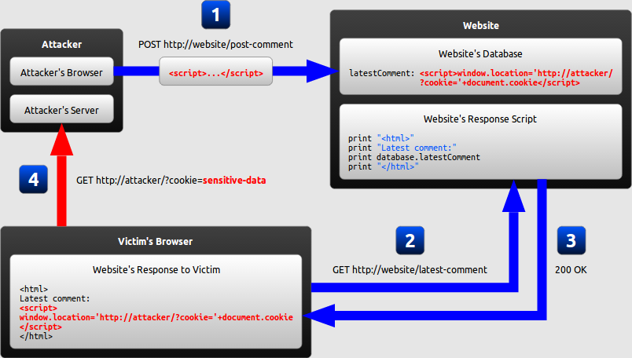

# 认识 XSS

本文翻译自 [excess-xss](https://excess-xss.com/)。

## 什么是 XSS？

Cross-site scripting (XSS) 是一种代码注入攻击手段，它允许攻击者在用户浏览器上执行恶意代码。

攻击者不直接指向受害者。事实上，攻击者是利用网站的漏洞来传播恶意代码，从而攻击受害者。在受害者的浏览器上，恶意代码是从服务器端返回过来的。

## 恶意代码注入过程

我们举一个简单的例子。如果服务端拼接 HTML 的代码如下：

```java
print "<html>"
print "Latest comment:"
print database.latestComment
print "</html>"
```

从代码来看，它假设 database.latestComment 是文本。但是，如果攻击者提交了注释 `<script>...</script>` 呢？

如果是这种情况，受害者打开浏览器，接收到的 HTML 如下:

```html
<html>
  Latest comment:
  <script>
    ...
  </script>
</html>
```

当浏览器开始渲染页面，会把攻击者提交的注释当作脚本执行。一次攻击就完成了。

## 恶意代码的危害

上面的代码能造成什么危害呢？危害有很多。原因是 JavaScript 太强大了：

- JavaScript 能获取用户的敏感信息，比如 cookie 等。
- JavaScript 能使用 XMLHttpRequest 或 fetch 发送敏感信息。
- JavaScript 能操纵 DOM 和 CSSOM。

恶意代码能造成以下危害：

- 盗取 cookie

  恶意代码可以将用户的 cookie 发送到攻击者的服务器上，获取 cookie 里的敏感信息，比如 sessionId 等。

- 按键记录

  恶意代码可以使用 `addEventListener` 来记录用户键盘上的按键记录，并发送到攻击者的服务器上，从而获得账户名和密码等信息。

- 钓鱼网站

  恶意代码可以操纵 DOM，插入一个虚假的表单指向攻击者的服务器。用户输入敏感信息后，攻击者服务器就有这些敏感信息了。

## XSS 角色分配

XSS 的角色主要有 3 种：

- The website

  网站服务器，用于生成 HTML。在我们的例子中，URL 是 http://website/。

  The website's database 是服务器对应的数据库，用于存储用户的输入信息。

- The victim

  受害者是一个普通的网站用户。

- The attacker

  攻击者是 XSS 攻击的发起者。

  The attacker's server 是攻击者用于收集用户隐私信息的服务器。在我们的例子中，URL 是 http://attacker/。

## XSS 的分类

### Persistent XSS

持久化型 XSS 攻击。



1. The attacker 将恶意代码注入到 The website's database
2. The victim 向 The website 发起请求
3. The website 将包含恶意代码的 HTML 发送给 The victim
4. The victim 的浏览器解析 HTML，执行恶意代码，将 cookie 发送给 The attacker

### Reflected XSS

反射型 XSS 攻击。


1. The attacker 将包含恶意代码的 URL 发送给 The victim
2. The victim 点击此 URL，向 The website 发起请求
3. The website 将包含恶意代码的 HTML 发送给 The victim
4. The victim 的浏览器解析 HTML，执行恶意代码，将 cookie 发送给 The attacker

### DOM-based XSS

基于 DOM 的 XSS 攻击。


1. The attacker 将包含恶意代码的 URL 发送给 The victim
2. The victim 点击此 URL，向 The website 发起请求
3. The website 并没有将包含恶意代码的 HTML 发送给 The victim
4. The victim 的浏览器解析 HTML，浏览器获得了地址栏中的 keyword，将 cookie 发送给 The attacker

### 区别

- Persistent XSS 和 Reflected XSS 攻击中，恶意代码是由服务端返回的。
- DOM-based XSS 攻击中，恶意代码不是由服务端返回的，只是攻击者利用了返回的 HTML 中的漏洞。其中有一种极端情况，就是将恶意代码放在 URL 的#后面或放在 LocalStorage 中。这样，服务端是压根不知道恶意代码的，但是和客户端能得到并执行恶意代码。

## 防止 XSS 攻击的方法
